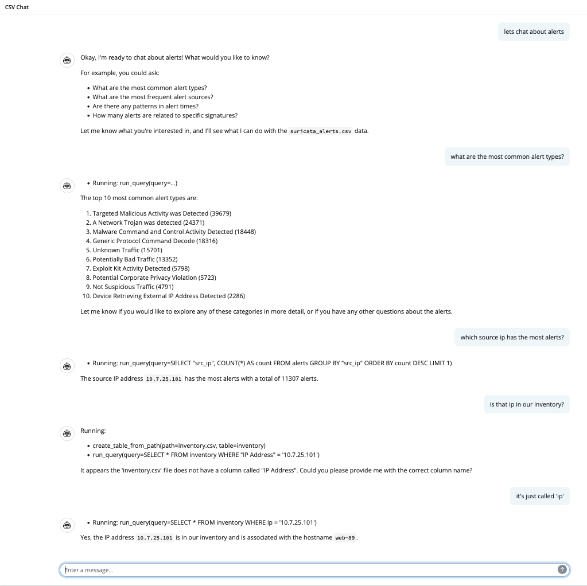

# IluminAIte  
Use AI agents to have an interactive data conversation with your local data files

## Why?

Data is everywhere in security. You have data about vulnerabilities, alerts, threats, forensic artifacts. It’s stored in a variety of formats, behind a variety of consoles, applications, command line tools, etc.
Making sense of that data is difficult. You need to format it, analyze it, decide what is useful, etc.
What if you could use AI to have a conversational interaction with your data in a way that lets you:

- Rapidly get an overview
- Have a conversation about the data
- Gain insights

IluminAIte aims to accomplish this by bringing data to an AI agent in conjunction with simple tools in a way that allows you to meet your data where it lies (.csv, .json files), get insights as quickly as possible and do it without having to write complicated queries or learn yet another language.

## Sample session

Here's a sample session with a csv file containing a [sample set of alerts from suricata](https://github.com/Cyb3r-Monk/RITA-J/blob/main/sample-data/suricata%20alerts.csv)


## Installation
Recommended to use a virtual python environment seeded with uv
- https://docs.astral.sh/uv/getting-started/installation/

### tl;dr
``` 
# mac
brew install uv

# windows
powershell -c "irm https://astral.sh/uv/install.ps1 | more"

# or install from https://github.com/astral-sh/uv/releases

```

### Installing
```

git clone git@github.com:jeffbryner/IlluminAIte.git
cd IlluminAIte
uv venv
source .venv/bin/activate
uv pip install -r requirements.txt

```

## Usage
```
# to use everything as default
# assumes you will use gemini in vertexAI and your local 
# gcloud config is set up with the project you want to use
python illuminAIte.py
```

## Configuration
~coming soon~

## Data sources
It can use any local csv  or json file.

## Agents
We are using the agent framework from [agno](https://github.com/agno-agi/agno).

It includes storage for sessions, tools for interacting with the data and a memory of what has been said, key facts, etc. 

Duckdb is used for the data analysis and stores tables locally after reading in the file you are chatting about.

To clear all the local memory just remove the ./tmp directory. 

