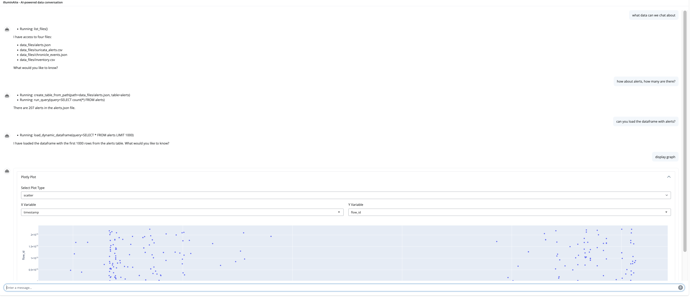
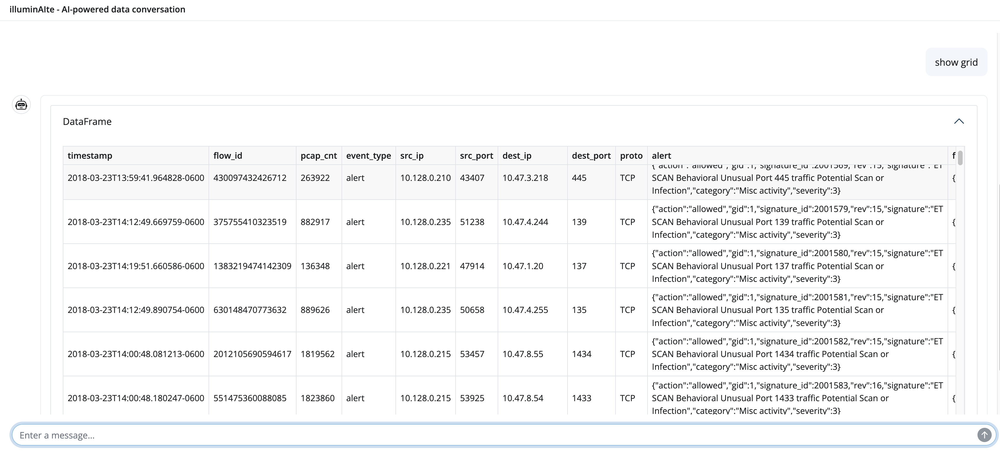

# illuminAIte  
Use AI agents to have an interactive data conversation with your local data files.

## Why?

Data is everywhere in security. You have data about vulnerabilities, alerts, threats, forensic artifacts. It’s stored in a variety of formats, behind a variety of consoles, applications, command line tools, etc.

Making sense of that data is difficult. You need to format it, analyze it, decide what is useful, etc.

What if you could use AI to have a conversational interaction with your data in a way that lets you:

- Rapidly get an overview
- Have a conversation about the data
- Gain insights

IlluminAIte (a play on illuminate suggested by AI) aims to accomplish this by bringing data to an AI agent in conjunction with simple tools in a way that allows you to meet your data where it lies (.csv, .json files), get insights as quickly as possible and do it without having to write complicated queries or learn yet another language.

The best security tools are simple ones that do a job well. IlluminAIte aims to be a straightforward and easy to way to harness the power of AI to make sense of your data.

## Sample session

Here's a sample session with a csv file containing a [sample set of alerts from suricata](https://github.com/Cyb3r-Monk/RITA-J/blob/main/sample-data/suricata%20alerts.csv)


Here's another showing the ability to display graphs


Another sample showing the ability to display a table grid of dataframe data


## Installation
Recommended to use a virtual python environment seeded with uv
- https://docs.astral.sh/uv/getting-started/installation/

### tl;dr
``` 
# mac
brew install uv

# windows
powershell -c "irm https://astral.sh/uv/install.ps1 | more"

# or install from https://github.com/astral-sh/uv/releases

```

### Installing
```

git clone git@github.com:jeffbryner/illuminAIte.git
cd illuminAIte
uv venv
source .venv/bin/activate
uv pip install -r requirements.txt

```

## Usage
```
# to use everything as default
# assumes you will use gemini in vertexAI and your local 
# gcloud config is set up with the project you want to use
python illuminAIte.py
```
You can ask it things like:
- What data can we chat about?
- Load < filename >
- Load the dataframe with the last X < data element > from < timeperiod >
- show graph (will trigger the dynamic graph)
- show table (will trigger the dynamic grid with a table view of the dataframe)
- what is the most frequent < data element >
- etc.

Depending on your LLM, it will be able to make liberal use of SQL to query the data. It may need some help with complex data elements like nested json, but you can assist it in your chat session. 
If it runs into errors, it will ask you to help it.

### Key Phrases
There are trigger phrases in the interface to do things that LLMs can't currently do. While there are libraries to display data grids and graphs for example, LLMs can't usually return a graph or table.

#### Phrase
- "load the dataframe"

This phrase will trigger the engine to load whatever data you've been chatting about into a pandas dataframe for use in a table/grid or a graph.

#### Phrase
- "show graph", "display graph", "display plot

Any of these phrases will trigger the engine to load the current dataframe into a plotly graph. You can then use the controls in the graph to choose the style of graph, the x/y coordinates, etc 

#### Phrase
- "show table", "show grid", "display grid"

Any of these phrases will trigger the engine to load the current dataframe into a dynamic data grid. You can use the grid to scroll through data, sort, filter, etc. 


## Configuration
To use other LLMs: 

### Ollama
First choose your model and download it to your local machine. Then you can run illuminAIte.py with the --provider=ollama flag.

```
# download the model
ollama pull llama2:13b
python illuminAIte.py --provider=ollama --model-name=llama2:13b

```
### OpenAI

Export your OPENAI_API_KEY as an environment variable, then run illuminAIte.py
```
export OPENAI_API_KEY=<your key>
python illuminAIte.py --provider=openai --model-name=gtp-4o

```

### Gemini via api key
Export your GEMINI_API_KEY as an environment variable, then run illuminAIte.py
```
export GEMINI_API_KEY=<your key>
python illuminAIte.py --provider=gemini --model-name=gemini-1.5-pro
```

## Data sources
It can use any local csv  or json file. Store the files in the ./data directory and ask the agent something like "what data can we chat about?" and it will list the files it can use.

## Agents
We are using the agent framework from [agno](https://github.com/agno-agi/agno).

It includes storage for sessions, tools for interacting with the data and a memory of what has been said, key facts, etc. 

Duckdb is used for the data analysis and stores tables locally after reading in the file you are chatting about.

To reset by clearing all the local memory just remove the ./tmp directory. It contains sqlite files storing the session, memory, duckdb tables, etc. 


## Data Handling & Bias Mitigation
All memories, session and duckdb data is stored locally and is not sent to any external servers. The system instructions specifically prohibit the LLM from using tools to send raw data files directly to the LLM.

Depending on your choice of model, you may send chat session to openai/google. If you run ollama, all traffic is local.. 

There is by default a duck duck go tool that allows searching the internet. You can disable this if you want by simply removing the tool. 

The repo includes publically accessible sample data that you can use to test the system without exposing any sensitive data of your own.

The gemini models include safety settings that are turned on by default. You can tweak them as you like.

